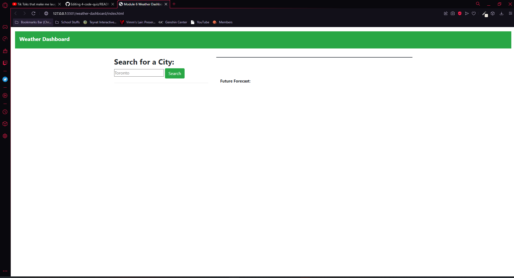
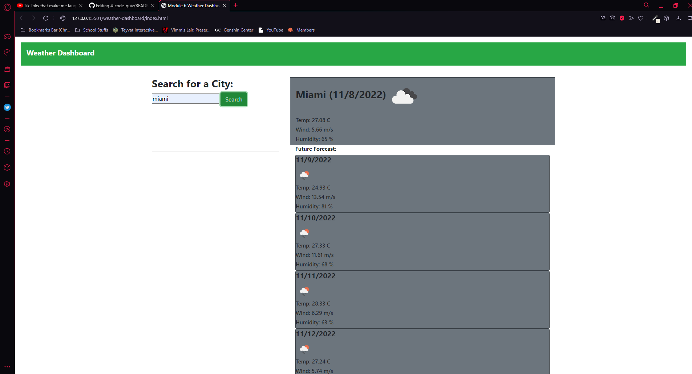

# 06 Server-Side APIs: Weather Dashboard

## Create a functional weather dashboard

## User Story

```
AS A traveler
I WANT to see the weather outlook for multiple cities
SO THAT I can plan a trip accordingly
```

## Acceptance Criteria

```
GIVEN a weather dashboard with form inputs
WHEN I search for a city
THEN I am presented with current and future conditions for that city and that city is added to the search history
WHEN I view current weather conditions for that city
THEN I am presented with the city name, the date, an icon representation of weather conditions, the temperature, the humidity, and the wind speed
WHEN I view future weather conditions for that city
THEN I am presented with a 5-day forecast that displays the date, an icon representation of weather conditions, the temperature, the wind speed, and the humidity
WHEN I click on a city in the search history
THEN I am again presented with current and future conditions for that city
```
## Usage

When you open the page you are met with a search bar, titled "search for a city". Upon entering a city, the webpage will use Othe 5 Day Weather Forecast API to generate the forecast for that city on the date you requested it along with five days after that.

## Screenshot



## Deployed Page

The webpage has been deployed at: https://bobascript.github.io/weather-dashboard/
